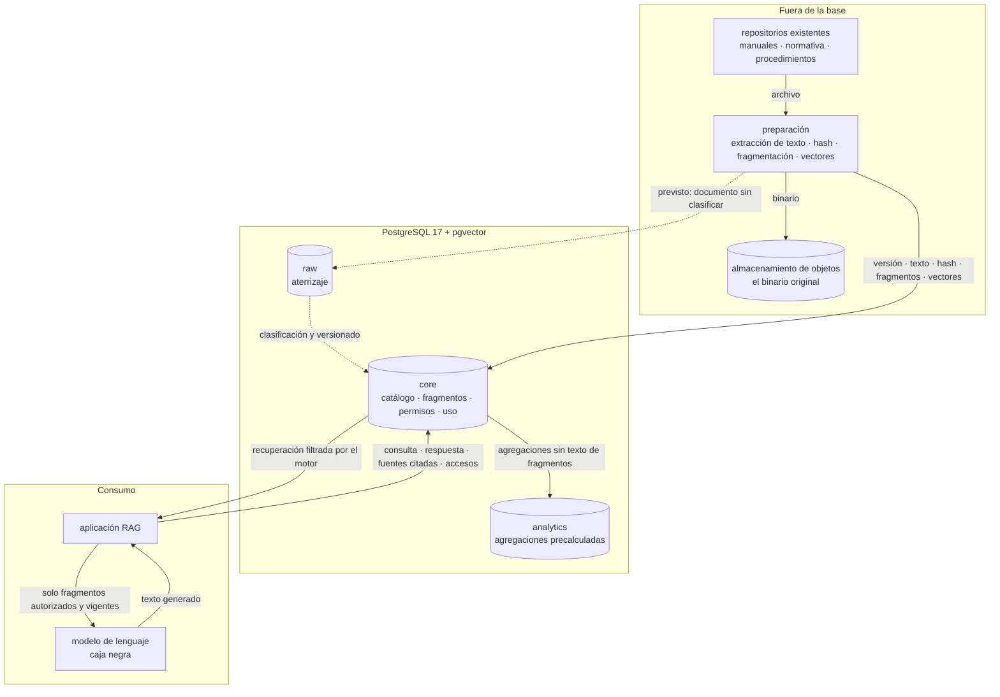

# Arquitectura de datos

Circulación de los datos desde que un documento entra a la organización hasta que alimenta una
respuesta y queda registrado. Corresponde al punto 12 del [informe](../informe.md), donde se
justifican las capas y los límites entre componentes.

## Vista general

Las flechas punteadas marcan el recorrido que el diseño contempla y que la implementación mínima
no puebla: el corpus de ejemplo ya llega curado, así que la preparación escribe directamente sobre
`core`. En una ingesta productiva, `raw` es donde el documento espera antes de ser clasificado.

## Qué muestra el dibujo

**El filtro está en el borde de `core`, no en la aplicación.** La flecha que sale hacia la
aplicación ya viene filtrada: lo que no está autorizado no cruza ese borde. Es la única garantía
del diseño que no puede mudarse a otro componente sin perderse.

**El binario nunca entra al motor.** Va al almacenamiento de objetos, y en la base quedan su URI,
su hash y el texto extraído (decisión D5).

**La preparación es un proceso externo.** La base no fragmenta ni vectoriza: recibe los fragmentos
armados. La única representación que calcula por su cuenta es la de búsqueda de texto completo,
que es una columna generada.

**`analytics` recibe agregaciones, no texto.** Un fragmento copiado a una vista materializada
perdería la clasificación de su documento, y con ella el control de acceso (R8).
