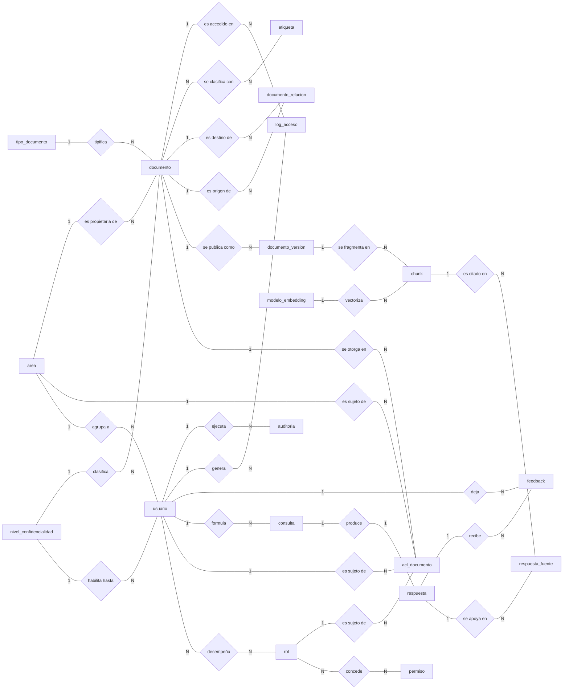
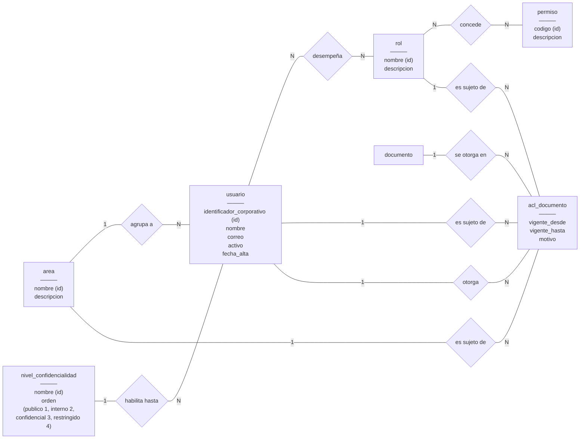
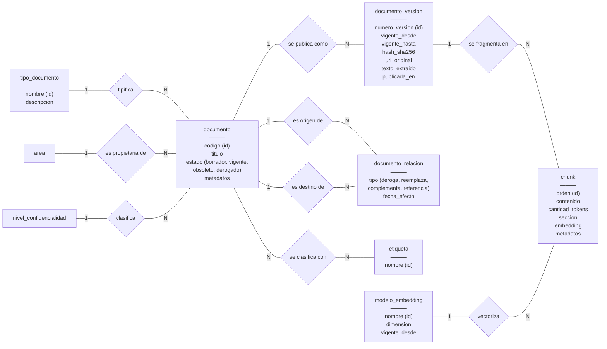
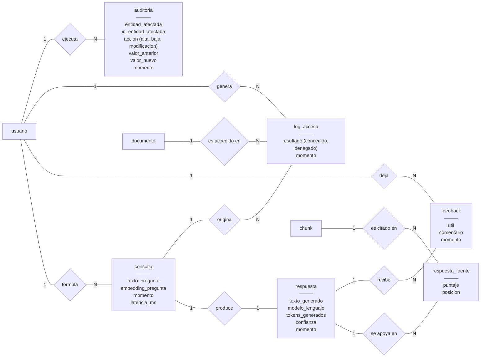

# Modelo conceptual

Diagrama entidad-relación del sistema RAG para consulta de documentación técnica. Corresponde al
punto 4 del [informe](../informe.md), donde se justifican las entidades, las cardinalidades y las
restricciones del dominio.

Los diagramas están escritos en Mermaid para poder versionarlos y ver los cambios en los *diffs*.
Se exportan a `.png` al cierre del trabajo.

## Notación

Las entidades son rectángulos con sus atributos; las relaciones, rombos. Sobre cada línea va la
cardinalidad de la entidad que tiene al lado: `1` si participa una sola instancia, `N` si
participan varias. `area 1 — agrupa a — N usuario` se lee «un área agrupa a N usuarios» y «un
usuario pertenece a un área».

El atributo que identifica a la entidad lleva `(id)`. No se dibujan claves foráneas: la
dependencia ya la expresa la relación. Las entidades sin `(id)` se identifican por un sustituto o
por una relación —el orden de un fragmento dentro de su versión, por ejemplo—; el identificador
completo de cada una está en la tabla del punto 4.2 del informe.

Las entidades ya detalladas en un diagrama anterior reaparecen en los siguientes sin atributos,
para mostrar las relaciones que cruzan de un bloque a otro.

---

## Vista general

Las tres zonas del modelo: quién puede ver qué, qué documentación existe, y qué se hizo con ella.

---

## Organización y control de acceso

Quién es cada usuario y qué documentación puede alcanzar. `acl_documento` expresa el
otorgamiento como una relación entre un documento y un sujeto, que puede ser un área, un rol o
un usuario individual.

Las tres relaciones «es sujeto de» son excluyentes entre sí: cada otorgamiento tiene un sujeto y
uno solo (restricción RD7 del informe). Es el arco exclusivo que el punto 4.6 deja abierto para
el modelo lógico.

---

## Documentación y contenido

El catálogo, su historial de versiones y el contenido fragmentado que alimenta la recuperación.

Los fragmentos cuelgan de la versión y no del documento (decisión D2): de esa pertenencia
heredan la vigencia y el nivel de confidencialidad, que no se guardan en el fragmento.

---

## Uso del sistema y auditoría

Qué se preguntó, qué se respondió y con qué material. `respuesta_fuente` es la entidad que
responde al requisito de registrar qué documentación se usó para construir cada respuesta.

`auditoria` no tiene relación con la entidad que audita: la identifica por nombre y por
identificador, sin integridad referencial. Es deliberado, porque el registro tiene que sobrevivir
a la baja de aquello que audita. Con una clave foránea, borrar un otorgamiento de acceso borraría
también la constancia de que existió.
