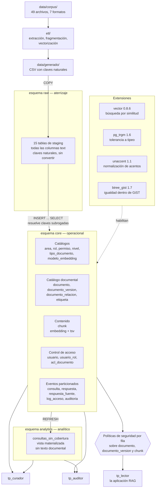

# Modelo físico

Cómo se implementa el modelo lógico en PostgreSQL 17 con pgvector: esquemas, extensiones, tipos,
particiones, índices, columnas generadas, políticas de seguridad por fila y privilegios.
Corresponde al punto 8 del [informe](../informe.md) y lo implementan los scripts de
[`db/estructura/`](../../db/estructura/) y [`db/indices_vistas/`](../../db/indices_vistas/).

La diferencia entre este modelo y el [lógico](modelo_logico.md) es lo que cada uno decide. El
lógico decide *qué* tablas hay, qué columnas y qué restricciones. El físico decide *cómo* eso vive
en un motor concreto: dónde se guarda cada cosa, cómo se accede, qué se precalcula y quién puede
tocarlo. Un modelo lógico se puede llevar a otro motor relacional; este no.

**Todo lo que sigue está medido sobre la base cargada** (46 documentos, 116 fragmentos, 400
consultas), no estimado.

---

## Vista general de la implantación



El binario original no entra a la base: `documento_version` guarda la URI del *object storage*, el
hash SHA-256 del archivo y el texto extraído.

---

## Extensiones

Cada una responde a una necesidad concreta del relevamiento, no a una lista de deseos.

| Extensión | Versión | Para qué | Sin ella |
|---|---|---|---|
| `vector` | 0.8.6 | Tipo `vector` e índice HNSW sobre los fragmentos | No hay búsqueda semántica |
| `pg_trgm` | 1.6 | Búsqueda tolerante a errores de tipeo sobre el título | El curador tiene que escribir el título exacto |
| `unaccent` | 1.1 | Normalización de acentos en la búsqueda de texto completo | `gestion` y `gestión` son lexemas distintos |
| `btree_gist` | 1.7 | Operador de igualdad dentro de un índice GiST | La restricción de exclusión de RD2 no se puede declarar |

Sobre `unaccent`: la configuración `spanish` que trae PostgreSQL lematiza pero no normaliza
acentos. `01_extensiones.sql` define una configuración propia, `public.espanol_unaccent`, que
antepone el diccionario `unaccent` al lematizador. No es un detalle estético: tres documentos del
corpus vienen de una exportación de texto plano **sin acentos**, y sin esta configuración serían
inencontrables para quien escriba con tildes.

## Tipos definidos

| Tipo | Valores |
|---|---|
| `core.estado_documento` | `borrador`, `vigente`, `obsoleto`, `derogado` |
| `core.tipo_relacion_documento` | `deroga`, `reemplaza`, `complementa`, `referencia` |

Son enumerados y no tablas catálogo porque el conjunto es cerrado y no tienen atributos propios. El
criterio inverso se aplicó a `nivel_confidencialidad` y a `tipo_documento`, que sí son tablas: el
nivel necesita un atributo `orden` —que participa de la regla de acceso— y el tipo necesita
descripción.

---

## Almacenamiento

Tamaño real de las tablas con datos cargados, incluidos sus índices y sus particiones:

| Tabla | Forma | Total | Qué la hace grande |
|---|---|---|---|
| `consulta` | particionada | 2.896 kB | El embedding de cada pregunta: 4.100 bytes por fila |
| `chunk` | común | 2.040 kB | 464 kB de vectores, 936 kB de índice HNSW, 94 kB de texto |
| `respuesta_fuente` | particionada | 840 kB | Volumen: 1.717 filas y crece con cada respuesta |
| `log_acceso` | particionada | 832 kB | Una fila por fragmento recuperado |
| `respuesta` | particionada | 664 kB | |
| `auditoria` | particionada | 440 kB | |
| `documento_version` | común | 192 kB | El texto extraído completo de cada versión |
| `documento` | común | 192 kB | |

El dato que conviene retener: **`consulta` ya es la tabla más grande de la base con 400 filas**, y
lo es sólo por guardar el vector de cada pregunta. Es el costo de haber decidido vectorizar las
consultas —lo que habilita detectar preguntas equivalentes y agrupar las que no tienen cobertura—,
y es la primera candidata a una política de retención.

---

## Particionado

Cinco tablas de eventos, particionadas por rango sobre `creado_en`:

| Tabla | Clave de partición | Particiones | Rango |
|---|---|---|---|
| `consulta` | `RANGE (creado_en)` | 13 | 12 mensuales de 2026 + `DEFAULT` |
| `respuesta` | `RANGE (creado_en)` | 13 | ídem |
| `respuesta_fuente` | `RANGE (creado_en)` | 13 | ídem |
| `log_acceso` | `RANGE (creado_en)` | 13 | ídem |
| `auditoria` | `RANGE (creado_en)` | 13 | ídem |

Son las cinco tablas que crecen con el uso y que casi siempre se consultan acotadas por fecha.

Tres consecuencias del particionado que el modelo lógico no muestra:

1. **La clave primaria tiene que incluir la clave de partición.** De ahí que sea `(id, creado_en)`
   y no `id`, y que las claves foráneas entre estas tablas arrastren la fecha. Eso además garantiza
   que padre e hijo caigan en la misma partición.
2. **Los índices se propagan.** Un índice creado sobre la tabla particionada se replica en cada
   partición existente y en las que se creen después. Por eso el catálogo informa 73 restricciones
   de clave foránea sobre `core` cuando el modelo tiene 34: el resto son las réplicas por partición.
3. **La partición `DEFAULT` es una red de seguridad**, no un destino esperado. Recibe las filas con
   fecha fuera del rango declarado, para que un evento mal fechado no rechace el `INSERT`. Sobre los
   datos cargados tiene **0 filas** en las cinco tablas, que es el resultado correcto: si concentra
   datos, es la señal de que hay que extender el rango.

El rango es deliberadamente chico —doce meses— porque alcanza para cargar los datos y mostrar poda
de particiones en un `EXPLAIN`. La automatización de particiones futuras (`pg_partman` o un job
programado) se analiza en el punto 14 del informe; no se implementa.

---

## Índices

51 índices sobre `core` y `analytics`. La mayoría son los que crean automáticamente las claves
primarias y las restricciones de unicidad; los interesantes son los otros.

### Por método de acceso

| Método | Cantidad | Para qué |
|---|---|---|
| `btree` | 46 | Claves, unicidad y filtros por igualdad o rango |
| `gin` | 3 | Texto completo, JSONB y trigramas |
| `hnsw` | 1 | Búsqueda por similitud sobre los vectores |
| `gist` | 1 | Restricción de exclusión sobre el rango de vigencia |

### Los que no vienen de una restricción

| Índice | Método | Tamaño | Qué consulta resuelve |
|---|---|---|---|
| `idx_chunk_embedding_hnsw` | hnsw | 936 kB | Búsqueda por similitud semántica (consultas 1 y 2) |
| `idx_chunk_tsv_gin` | gin | 192 kB | Mitad léxica de la recuperación híbrida (consulta 2) |
| `idx_documento_titulo_trgm` | gin | 64 kB | Búsqueda por título tolerante a tipeo, para el curador |
| `idx_documento_metadatos_gin` | gin | 32 kB | Filtrado por atributos variables de `metadatos` |
| `idx_documento_estado` | btree | 16 kB | Filtro de vigencia, presente en todo el camino crítico |
| `idx_acl_documento_documento_id` | btree | 16 kB | El `EXISTS` que evalúa la política de RLS en cada fila |
| `idx_consulta_usuario_id` | btree | propagado | Agregación de uso por área (consulta 4) |
| `idx_respuesta_fuente_chunk_id` | btree | propagado | Documentos más citados (consulta 4) |
| `idx_log_acceso_documento_id` | btree | propagado | Quién accedió a un documento (consulta 3) |
| `idx_auditoria_entidad` | btree | propagado | Historial de cambios de una fila puntual |

`idx_acl_documento_documento_id` es el más importante de la lista aunque no responda ninguna
pregunta del usuario: es el que usa `core.puede_acceder_documento()` en **cada fila** que evalúa la
política de seguridad. Su costo es el costo de haber puesto el control de acceso en el motor.

`idx_chunk_embedding_hnsw` se construye con `vector_cosine_ops`, que tiene que coincidir con la
métrica declarada en `modelo_embedding.metrica`. Si no coinciden, el índice no se usa y el síntoma
es que la consulta funciona pero lenta, que es la peor forma de enterarse.

### Una advertencia sobre el índice vectorial

Con 116 fragmentos el planificador **no usa** `idx_chunk_embedding_hnsw`: un recorrido secuencial es
más barato. Para verlo en acción hay que forzarlo con `enable_seqscan = off`. Es esperable y no es
un defecto del índice; es la señal de que el volumen de la implementación mínima no alcanza para
ejercitar esa parte. El análisis de qué pasa con ese índice a escala, y de cómo interactúa con las
políticas de seguridad por fila, está en
[`vectorial/modelo_vectorial.md`](../../vectorial/modelo_vectorial.md).

---

## Columnas generadas

Una sola, y es importante:

```sql
tsv tsvector GENERATED ALWAYS AS (
        to_tsvector('public.espanol_unaccent'::regconfig, texto)
    ) STORED
```

No se inserta ni se actualiza: el motor la deriva de `texto`. La consecuencia es que **no puede
desincronizarse del texto que representa**. La alternativa habitual —un disparador que la mantiene—
funciona igual de bien hasta el día que alguien escribe un `UPDATE` que lo evita.

---

## Seguridad por fila

Tres tablas con seguridad por fila habilitada y forzada, tres políticas cada una:

| Tabla | Habilitada | Forzada | Políticas |
|---|---|---|---|
| `documento` | sí | sí | `documento_lector`, `documento_gestion`, `documento_auditor` |
| `documento_version` | sí | sí | ídem |
| `chunk` | sí | sí | ídem |

| Política | Comando | Roles | Qué hace |
|---|---|---|---|
| `*_lector` | `SELECT` | `tp_lector` | Aplica la regla de acceso del punto 4.4 |
| `*_gestion` | `ALL` | `tp_curador`, `tp_admin` | Visibilidad completa: no se puede clasificar lo que no se ve |
| `*_auditor` | `SELECT` | `tp_auditor` | Visibilidad completa, incluido el histórico derogado |

`FORCE ROW LEVEL SECURITY` importa: sin él, el dueño de la tabla ignora sus propias políticas. En
este entorno el dueño es superusuario y PostgreSQL nunca aplica seguridad por fila a un
superusuario, así que `FORCE` no cambia nada acá; se declara porque es lo correcto para un
despliegue donde el dueño del esquema no lo sea.

`documento_version` tiene política propia y no sólo `chunk`, porque `documento_version.texto` es el
texto completo extraído. Sin ella, cualquiera con `SELECT` sobre la tabla lo leería entero sin pasar
por la fragmentación, que rompe la garantía por una vía distinta de la búsqueda semántica.

### Las funciones que evalúan la regla

| Función | `SECURITY DEFINER` | Volatilidad |
|---|---|---|
| `core.puede_acceder_documento(bigint)` | sí | `STABLE` |
| `core.puede_acceder_chunk(bigint)` | sí | `STABLE` |

`SECURITY DEFINER` es lo que permite que `tp_lector` evalúe la regla **sin tener `SELECT` sobre
`acl_documento` ni sobre `usuario_rol`**, que son de las tablas más sensibles del modelo. Ambas
fijan su `search_path`: una función `SECURITY DEFINER` que no lo hace es vulnerable a que quien la
llama redefina un objeto con el mismo nombre en un esquema anterior en su propio camino de
búsqueda. Y a ambas se les revoca `EXECUTE` de `PUBLIC`, porque a diferencia de las tablas, las
funciones nuevas lo otorgan por omisión.

La aplicación declara quién pregunta con `SET LOCAL app.usuario_id = <id>` al abrir la transacción.
Si no lo declara, `current_setting('app.usuario_id', true)` devuelve nulo, la comparación falla y no
se devuelve ninguna fila: el modo de falla es cerrado.

---

## Privilegios

| Rol | Privilegios | Tablas alcanzadas | Función |
|---|---|---|---|
| `tp_lector` | `SELECT`, `INSERT` | 12 | Conexión de la aplicación RAG. Sobre él actúan las políticas |
| `tp_curador` | `SELECT`, `INSERT`, `UPDATE` | 18 | Carga, clasifica, versiona y otorga accesos |
| `tp_auditor` | `SELECT` | 22 | Sólo lectura, sobre todo, incluida la auditoría |
| `tp_admin` | `SELECT`, `INSERT`, `UPDATE`, `DELETE` | 22 | Administración |

Cuatro decisiones de privilegios que vale la pena leer en el DDL y que no se deducen del modelo
lógico:

- **`tp_lector` no tiene `SELECT` sobre `acl_documento`, `usuario` ni `usuario_rol`.** Resuelve la
  regla de acceso a través de las funciones, sin ver la tabla. Sin esto, un usuario podría deducir
  por diferencia qué documentos existen aunque no pueda verlos.
- **`tp_lector` no tiene `SELECT` sobre `consulta` ni `respuesta`**, sólo `INSERT`. No hay requisito
  del caso que exija que alguien lea las preguntas de otro, y `INSERT ... RETURNING` no necesita
  `SELECT` para recuperar el identificador recién generado.
- **Nadie tiene `UPDATE` ni `DELETE` sobre `log_acceso` ni `auditoria`**, `tp_admin` incluido. La
  garantía de que son de sólo inserción (RD13) es que nadie pueda alterarlas, no que el
  administrador elija no hacerlo.
- **`tp_curador` no tiene `DELETE` sobre `acl_documento`.** Revocar un permiso es cerrar su ventana
  de vigencia con un `UPDATE`, no borrar la fila: si se borrara, se perdería el historial de quién
  tuvo acceso a qué y hasta cuándo.

---

## Capa analítica

Una vista materializada, `analytics.consultas_sin_cobertura`, con un índice único sobre
`consulta_id` que habilita `REFRESH MATERIALIZED VIEW CONCURRENTLY` —refrescar sin bloquear las
lecturas, relevante porque se calcula sobre `consulta`, la tabla de mayor volumen de escritura—.

Se creó `WITH NO DATA`: la puebla el primer `REFRESH` después de cargar los datos, en
[`db/datos/04_cierre.sql`](../../db/datos/04_cierre.sql).

Contiene el texto de la pregunta y nada más: ni texto de fragmentos ni de documentos. Es
deliberado. La capa analítica la consultan roles distintos de los del camino crítico, y si
arrastrara contenido documental, el control de acceso que las políticas sostienen sobre `chunk` se
evitaría dando la vuelta por `analytics`.

Las otras tres vistas que describe el informe —documentos más citados, uso por área, antigüedad de
lo consultado— se resuelven hoy con consultas directas (`db/consultas/04_uso_por_area.sql`). Son
agregaciones del mismo estilo sobre las mismas tablas y no agregan nada a la validación del diseño;
se justifican sin construirse.
