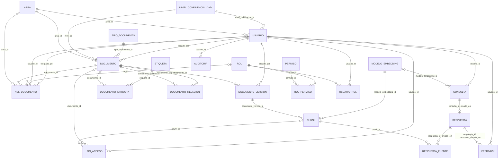
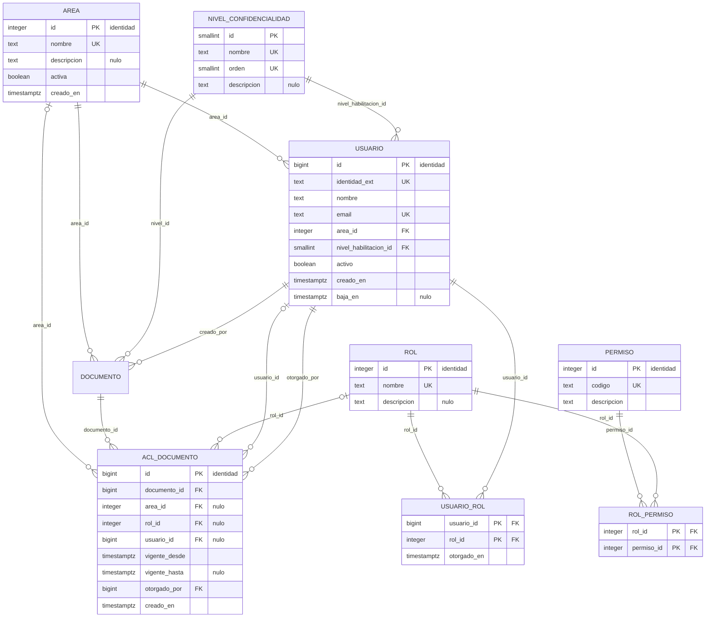
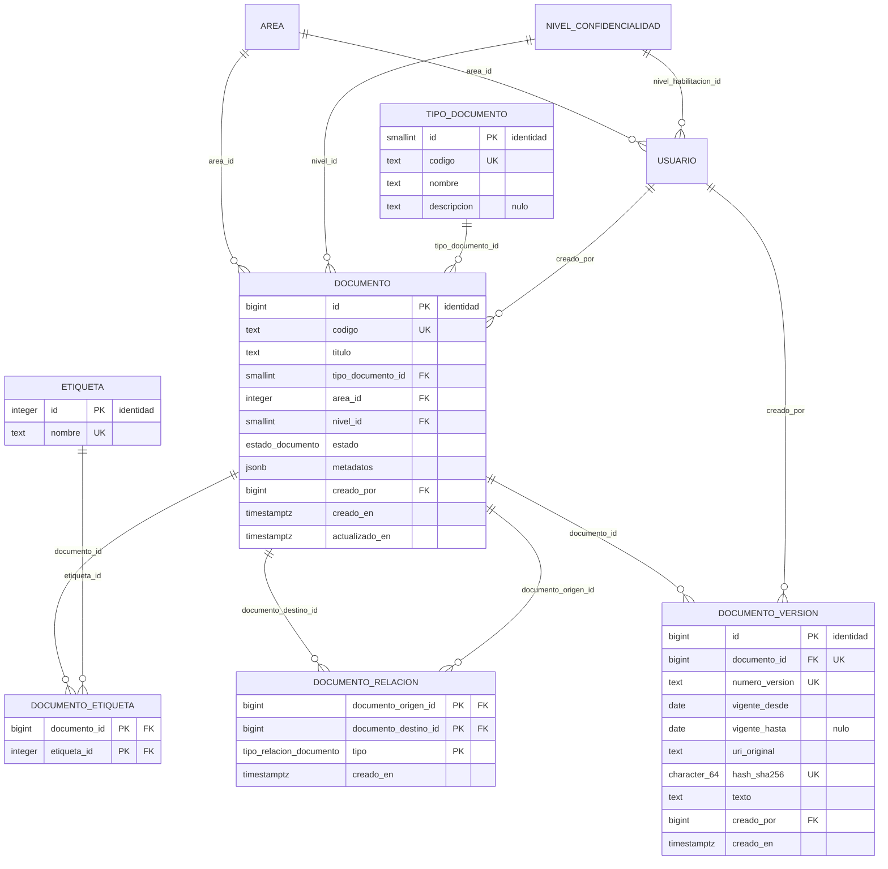
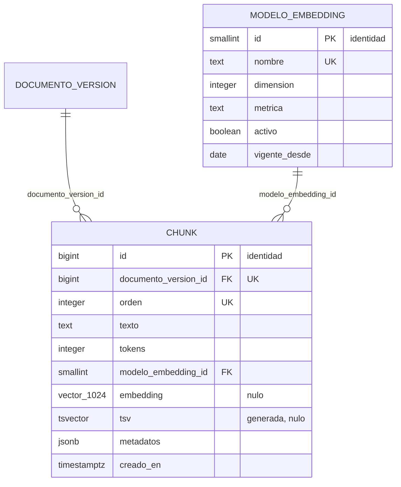
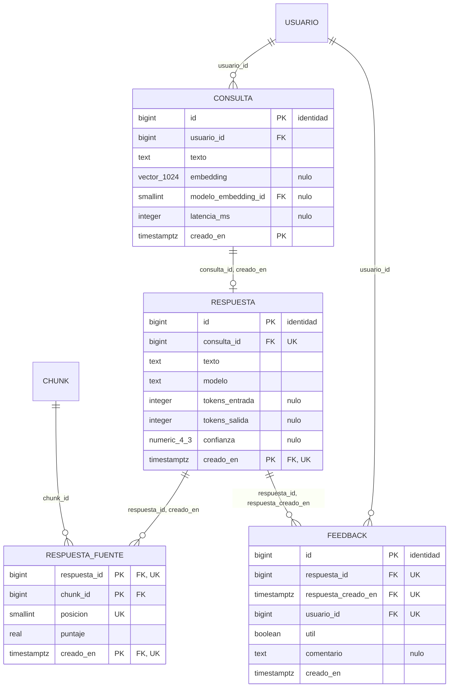
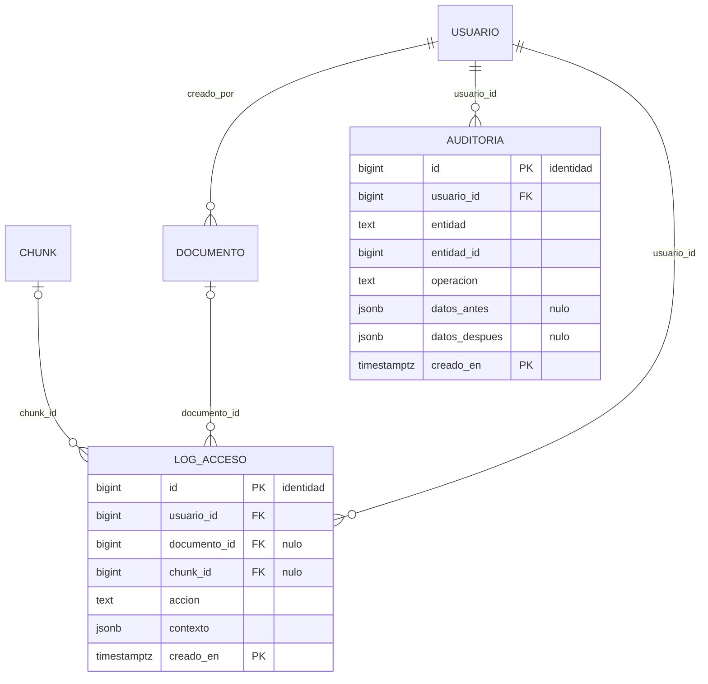

# Modelo lógico relacional

Traducción del modelo conceptual a un esquema relacional: tablas, columnas, tipos, claves
primarias, claves foráneas y restricciones de integridad. Corresponde al punto 5 del
[informe](../informe.md), donde se justifica cada criterio de traducción, y lo implementa
[`db/estructura/03_tablas.sql`](../../db/estructura/03_tablas.sql).

Los diagramas están escritos en Mermaid para poder versionarlos y ver los cambios en los *diffs*.
Se exportan a `.png` al cierre del trabajo.

**Están generados a partir del catálogo de la base, no transcritos a mano.** Es la única forma de
garantizar que el diagrama y el DDL no se contradigan: si alguien agrega una columna al script y no
al diagrama, el diagrama deja de ser documentación y pasa a ser una afirmación falsa.

## Notación

Notación *crow's foot* de Mermaid. Sobre cada línea va el nombre de la columna que implementa la
clave foránea.

| Símbolo | Lado | Significado |
|---|---|---|
| `\|\|` | padre | La clave foránea es `NOT NULL`: el hijo tiene **exactamente un** padre |
| `\|o` | padre | La clave foránea admite nulo: el hijo tiene **cero o un** padre |
| `o{` | hijo | El padre tiene **cero o más** hijos |
| `o\|` | hijo | Hay unicidad sobre la clave foránea: el padre tiene **a lo sumo un** hijo (relación 1:1) |

En los atributos, `PK` marca la clave primaria, `FK` la clave foránea y `UK` la restricción de
unicidad. Cuando un atributo lleva más de una marca, la segunda va en el comentario. El comentario
indica además si la columna admite nulo, si es generada y si su valor lo asigna el motor
(`identidad`).

---

## Vista general

Las 22 tablas del esquema `core` y sus 34 claves foráneas. Sin atributos, para que se vea la
estructura de dependencias.

Vale una aclaración sobre ese número: el catálogo de PostgreSQL informa 73 restricciones de clave
foránea sobre `core`. Son las mismas 34, replicadas: cuando una tabla particionada participa de una
clave foránea, el motor crea una restricción hija por cada partición. Contarlas sin filtrar las
réplicas duplica el modelo.

---

## Organización y control de acceso

`acl_documento` es la tabla más crítica del modelo: de ella dependen las políticas de seguridad por
fila.

**El arco exclusivo.** El modelo conceptual dice que un otorgamiento tiene un sujeto y uno solo, que
puede ser un área, un rol o un usuario. Se implementa con tres claves foráneas que admiten nulo
—de ahí el `|o` en las tres líneas— más la verificación `num_nonnulls(area_id, rol_id, usuario_id) = 1`,
que garantiza que exactamente una esté informada. La alternativa, tres tablas separadas, sería más
estricta pero triplicaría la consulta que la política de RLS ejecuta en cada recuperación.

`usuario` aparece dos veces como padre de `acl_documento`: una como sujeto del otorgamiento
(`usuario_id`, que admite nulo) y otra como quien lo otorgó (`otorgado_por`, obligatoria). Son dos
roles distintos de la misma entidad y por eso son dos columnas.

**`nivel_habilitacion_id` es el techo de la regla de acceso.** Es una propiedad de la persona, no
del rol que cumple: dos usuarios con el mismo rol pueden tener habilitaciones distintas. Sin esta
columna, la primera condición de la regla de acceso no tendría dónde apoyarse.

---

## Catálogo documental

**`documento_relacion` es una autorrelación.** `documento` aparece dos veces como padre —origen y
destino— y la clave primaria es `(origen, destino, tipo)`, porque dos documentos pueden vincularse
por más de un motivo. Una verificación impide que un documento se relacione consigo mismo.

**`documento_etiqueta` es una tabla puente pura**: clave primaria compuesta por las dos foráneas y
ningún atributo propio. `documento_relacion`, en cambio, tiene atributos —el tipo y la fecha— y por
eso es una entidad y no una tabla puente.

**La vigencia sin solapamiento.** `documento_version` lleva una restricción de exclusión
`EXCLUDE USING gist (documento_id WITH =, daterange(vigente_desde, vigente_hasta, '[]') WITH &&)`
que garantiza que un documento no tenga dos versiones vigentes en el mismo instante (RD2). No es una
restricción que el diagrama pueda mostrar, pero es la más importante de esta tabla.

---

## Contenido y representación vectorial

**El fragmento cuelga de la versión, no del documento** (decisión D2). De esa pertenencia hereda su
nivel de confidencialidad y su vigencia: `chunk` no tiene columna de nivel, y esa ausencia es
deliberada. Un nivel propio en el fragmento sería un dato duplicado que puede quedar desalineado del
documento, y el día que se desalinee, la desalineación es una fuga.

**`tsv` es una columna generada.** No se inserta: el motor la deriva de `texto`, de modo que no
puede desincronizarse de él.

**La dimensión está en el tipo.** `vector_1024` no es una anotación del diagrama: es el tipo de la
columna. Cambiar de modelo de embeddings conservando la dimensión es una revectorización; cambiar de
dimensión exige una columna nueva. Que sea el tipo el que lo impone obliga a que ese cambio sea una
decisión y no un efecto colateral.

---

## Uso del sistema

**Las claves foráneas arrastran la fecha.** `respuesta` referencia a `consulta` por
`(consulta_id, creado_en)` y no sólo por el identificador. Hay dos motivos: en una tabla
particionada la clave primaria debe incluir la clave de partición, y arrastrar la fecha garantiza
que padre e hijo caigan en la misma partición.

**`CONSULTA ||--o| RESPUESTA` es la única relación 1:1 del modelo.** El símbolo `o|` lo produce la
restricción `UNIQUE (consulta_id, creado_en)`: una consulta produce a lo sumo una respuesta. Puede
no producir ninguna, y eso no es un caso de error: es una consulta sin cobertura, que es
precisamente lo que la capa analítica busca.

**`respuesta_fuente` responde el requisito central del caso.** Registra qué fragmentos originaron
cada respuesta, con su posición en el ranking y su puntaje. La posición y el puntaje son lo que
permite explicar *por qué* el modelo dijo lo que dijo, y no sólo qué documentos tenía a mano.

---

## Auditoría

**`auditoria` no tiene clave foránea hacia la entidad que audita.** La identifica por nombre de
tabla (`entidad`) e identificador (`entidad_id`), sin integridad referencial. Es deliberado: el
registro tiene que sobrevivir a la baja de aquello que audita. Con una clave foránea, borrar un
otorgamiento de acceso borraría también la constancia de que existió.

`log_acceso` sí tiene claves foráneas, y ambas admiten nulo: un acceso puede registrarse sobre un
documento, sobre un fragmento o sobre los dos, y una verificación exige que al menos uno esté
informado.

---

## Restricciones que el diagrama no puede mostrar

Un diagrama entidad-relación muestra estructura, no reglas. Estas son las restricciones de
integridad que el DDL declara y que hay que leer en
[`03_tablas.sql`](../../db/estructura/03_tablas.sql):

| Tipo | Ejemplo | Qué garantiza |
|---|---|---|
| Exclusión (`EXCLUDE USING gist`) | `documento_version` | A lo sumo una versión vigente por documento en cada instante (RD2) |
| Verificación de arco exclusivo | `acl_documento` | Exactamente un sujeto por otorgamiento (RD7) |
| Verificación anti-reflexiva | `documento_relacion` | Un documento no se relaciona consigo mismo |
| Verificación de coherencia de fechas | `documento_version`, `acl_documento` | La vigencia no termina antes de empezar |
| Verificación de coherencia de baja | `usuario` | Un usuario inactivo tiene fecha de baja, y uno activo no |
| Unicidad de hash | `documento_version` | El mismo archivo no se ingesta dos veces (RD6) |
| Verificación de formato | `permiso.codigo`, `usuario.email`, `hash_sha256` | Los valores respetan el formato del dominio |
| Tipo enumerado | `estado_documento`, `tipo_relacion_documento` | El conjunto de valores es cerrado |

Tres restricciones del dominio siguen pendientes porque dependen de disparadores que no se
escribieron: RD4 (que un documento derogado no tenga una versión con vigencia abierta), RD5
(ausencia de ciclos en la derogación) y la mitad de RD9 (que los órdenes de los fragmentos de una
versión sean consecutivos, no sólo únicos). Están documentadas en el punto 8.2 del informe.
